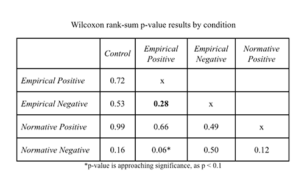

Based on what we learned from the 3-way ANOVA excerises, research colleagues ran measures of dishonesty rate (previously measured honesty in the ANOVAs) against each of the five conditions for our experiment based on the message they received before the dice roll game: the control group, empirical positive, empirical negative, normative positive, and normative negative. The additional benefit of this structure provided us flexibility such that we could analyze effects between conditions at the individual level or time-series level. Across treatments and populations, 32.9% of decisions were reported dishonestly in our experiment.
	
The conditions were fairly balanced on size and gender split but differed slightly on average dishonesty and the variability of dishonesty. The control group (M = 36.5%, SD = 45.1%) had 33 participants, 55% of whom were female. The empirical positive (EP) condition (M = 39.6%, SD = 40.1%) had 39 participants, 54% of whom were female. 33 participants, 67% female comprised the empirical negative (EN) condition (M = 25.8%, SD = 45.5%). There were 38 normative positive (NP) participants (M = 38.0%, SD = 44.6%), of whom 55% were female. Lastly, the normative negative (NN) condition of 38 participants, 47% female, had the lowest variability and level of dishonesty (M = 21.1%, SD = 34.6%). 

Within each condition there were participants who never lied, lied some of the time, and lied every chance they had. Although the latter of these is the optimal economic decision, so as to maximize their chance at winning the raffle reward, the majority of participants in all conditions chose not to lie at all.

####Normative versus empirical messages, H1.

In order to test H1, which was that normative messages would result in less dishonest behavior than empirical messages, we ran a Wilcoxon rank-sum test between the two independent groups’ lying behavior at the individual level. Similar to the ANOVA, this test found no significant difference in dishonesty between participants who received an empirical or normative message, W = 2531, p = 0.39, thus we could not reject the null. 

When we ran the same test on type of frame used in a message however, the result of participants cheating less in the negatively-framed treatments is much closer to the generally accepted significance threshold, W = 3180.5, p = 0.06. 

To analyze the differences in means between our conditions independently, rather than grouping the type of norm or frame, we used a Kruskal Wallis H-Test as a non-parametric equivalent of a one-way ANOVA to detect any differences among more than two independent groups (Vargha & Delaney, 1998) There was not a statistically significant difference between the percentage of lying behavior in our five conditions, H(4) = 4.46, p = 0.35.

####Message and frame interaction, H2.
Despite the insignificance of the aforementioned statistics, we then looked at pairwise Wilcoxon rank-sum tests to compare conditions to each other directly. Because the samples are independent, this test was used instead of the Wilcoxon signed-rank test. The Wilcoxon rank-sum tests the null hypothesis that a randomly selected value from one condition is equally likely to be greater or less than a value from the other condition (Wild & Serber, 2011). Therefore, a significant result implies a consistent distinction between measured group values. The resulting p-values were calculated without any multiple comparison correction and are presented below.

####Time-series analysis, H3.
Our final hypothesis, H3, was that positively framed messages would lead to honesty persisting longer through the ten rounds. We coded the data into lying averages per round, rather than per individual, to investigate this idea and split the round averages by condition. This setup allowed us to look at a multiple regression to predict the percentage of dishonesty based on condition and round number. Unfortunately, this model prevented any statistical analysis on an interaction between condition and round because the number of datapoints is too few to have sufficient degrees of freedom. 
However, the regression equation proved to be significant, F(13,36) = 17.18, p < 0.001, and explained 81% of the variance in dishonesty rates. Within this regression there were two significant effects of condition and multiple by round. Both empirical negative and normative negative messages predicted lower levels of lying by about 15% compared to the other conditions, p < 0.001 for both. 
Three different rounds predicted significantly more lying when compared to round one and another three rounds were approaching significance in the same direction. In general, this majority suggests that the messages may have been somewhat successful initially and prevented a significant amount of dishonesty from occurring in round one. Rounds two, five, and ten displayed significantly more lying than round one, by about 7% at p < 0.01. Rounds four, seven, and eight showed higher levels of lying but were only approaching significance, with p = 0.07 on average. The only round with an extremely insignificant p-value in comparison to round one is round nine. 

Consistent with earlier analyses suggesting the power of a negative frame and messages generally seem to decrease lying in round one, an interaction between the two independent variables is needed to fully support H3. The graph below provides a visual representation of the percentage of dishonest behavior by Round/Condition that we were hoping to test.

####Advanced Analysis
In order to capture the number of decisions each participant made, we transformed the dataset in order to run a panel data regression. This test uses participant ID numbers and round numbers to avoid collapsing multiple decisions into an individual average. The issues with relying on the individual average include losing power unnecessarily, because the average could reflect two or ten decisions, and not controlling for the fact that each individual’s decisions are influenced by those that came before it. We ran a series of four regressions on the panel data in order to explore the impacts of the variables on the percentage of dishonest behavior.

  - Influence of condition on the dependent variable and found both empirical negative and normative negative messages relating to significantly lower rates of lying behavior (inclusive of clustering the standard errors at the individual level), p = 0.22.
  
  - Gender interaction with the condition variable,with males being significantly more likely to lie at p < 0.001, and an effect of empirical messages decreasing lying behavior among men, p = 0.01, such that the expected increase (~20%) based on gender alone is almost completely negated.
  
  - Interaction of risk and condition reported a strange effect in relation to the normative positive condition. The beta for this condition is extremely negative, after being positive in the original regression, whereas the interaction term was significantly positive at p = 0.02.

  
  

  