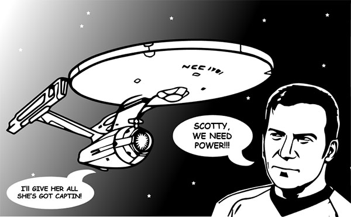

Overall the biggest limitation of this study is that lack of statistical power. Similiar studies found in our researched reported participation ranging from N=237 to as high as N=734. Despite the existence of  differences in support of our initial hypothesis, the differences are not significant enough to quantify a conclusion. However, such limitation can be addressed by gathering more data such that findings reach full power. 

While diversity in participants was a strength in the experimental design that allowed generalization of our results across populations, we acknowledge limitations in the quantity of participants. One main reason this limitation is that involving incomplete survey completion. Within in our experimental design, the study was presented in one of two methods, a link or a QR code, either through principle researchers or by associates. The use of transmittable links may have reduced experimenter control such that participants felt less inclined to complete the study. Future replications of this study may consider measures to increase experimental control. This can be done by the presence of principle researchers in the immediate locality of the participants. Other measures can be put in place to maximize completion of the survey such that reminders that  a salient reward can only be obtained upon completion of the entire survey. 

Moreover, upon consideration, we question the salience of the incentive in this experiment. While we purposefully did not announce the exact value of the gift card, we acknowledge that participants were met with a possibility of winning a gift card and thus they may have not been incentivized to complete the study. Lack of financial incentive apart from complying with the experimenter can account for participants beginning but not finishing the survey. Without a guaranteed financial reward, it can be difficult to secure consistent task completion strictly upon request.  However, it  must be noted that research by Kajackaite and Gneezy (2017) show that increasing incentives did not incite lying. Their research noted that financial incentives are overpowered by intrinsic costs of lying, more specifically the fear of being caught in a lie. Thus while incentives provide some motivations for guiding behavior, they can be limited and overwhelmed by other drivers of behavior (Kajackaite, & Gneezy, 2017).

Deception in this study is self-oriented. Generalizability thus is limited to other forms of deception. Previous research notes that gender differences in deception, more specifically, lying, are dependent on the nature and goal associated with the lie (Dreber & Johanneson 2008). Across treatments, the messaging were self-oriented such that lies were told to advance personal financial investment. Had the messages been other-oriented such that deception was a means to advance the interests of others, gender differences may have been different from that presented in this paper. 

Despite limitations in our design, the study presented in this paper serves to highlight critical gaps in the social norms and framing research, and opportunity for greater discovery.
