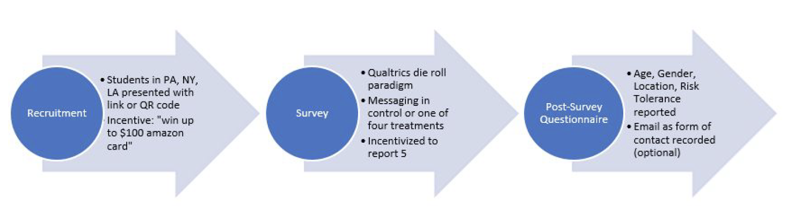
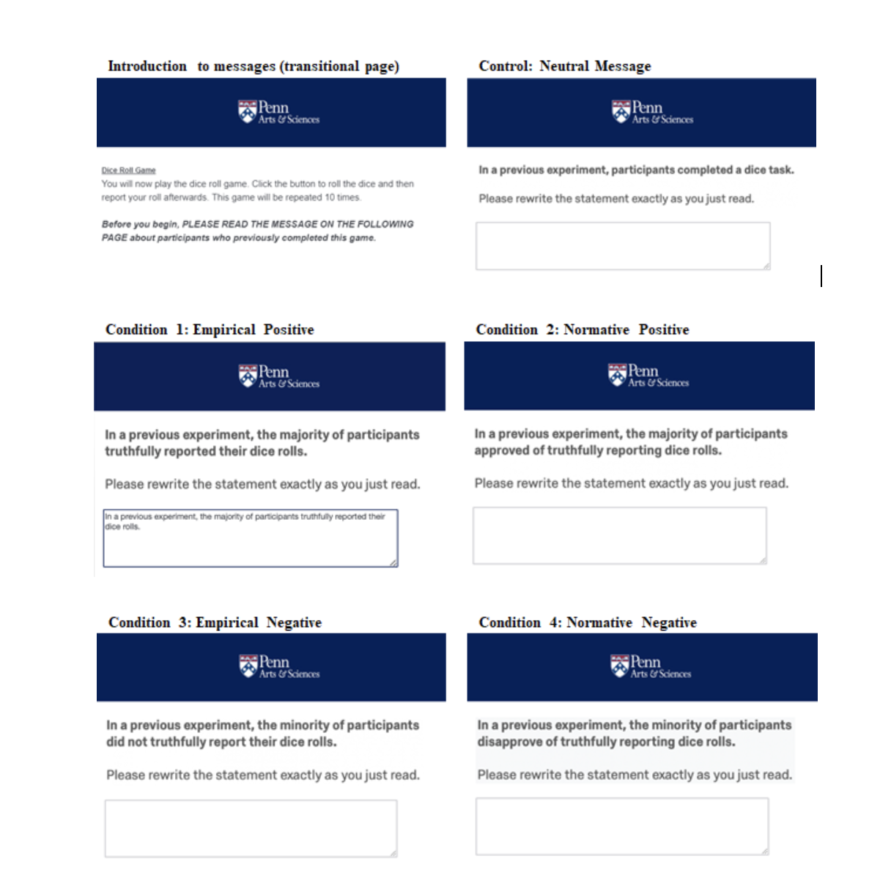

We recruited students from multiple college campuses in New York, Philadelphia, and Los Angeles to ensure a larger sample size; N=182. Included in the procedure were the following: 

- Fields to confirm informed consent and game instructions

- Addtional comprehension check, where each participant would read the randomly assigned norm message regarding honest behavior, and then retype it verbatim for added salience and onfirmation that the participant actually read the material.  

- Short survey that included data capture for incentivized majority & minority meaning (robustness), demographics, risk assessment, age, gender, location of completion (University affiliation), display of final raffle ticket amount & contact email.

Participants then saw one of the four messages based on their randomly assigned condition. Qualtrics’ randomization feature ensured that participants were randomly assigned to either one of the four treatment conditions or the control condition. For each condition, participants saw a message and were required to retype it exactly so that they further internalized what the message communicated. 

