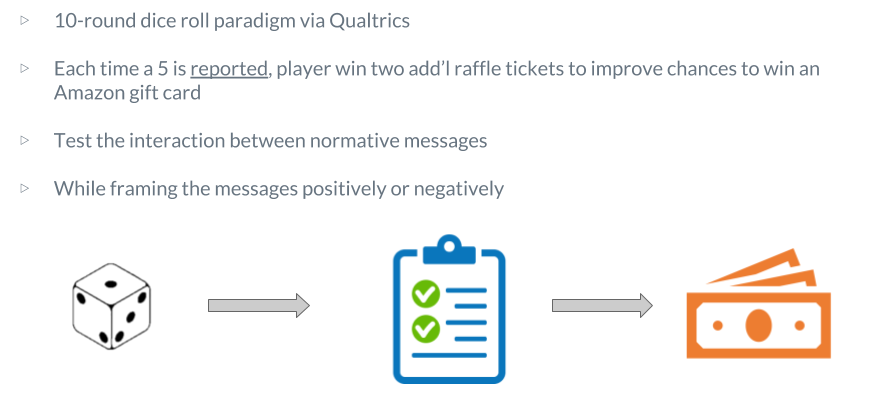

The aim of this research is to advance Cialdini et al’s work of testing descriptive vs injunctive norms which does not distinguish between independent and interdependent behavior by, leveraging Bicchieri’s (2006, 2016) framework, in which we will focus on the results of interdependent behavior.

  This research integrates the works Bicchieri’s (2016) Social Norm Theory with Cialdini et al’s injunctive and descriptive norm work that first, addresses the interdependent conditional preference “my preference depends on what I expect others do or what I expect others think I should do.” Second, we want to incorporate Cialdini et al’s norm focus learnings in measuring the efficacy of positive versus negative message framing. 
  
Additionally, when an individual is temporarily focused on the normative consideration, the decision is more likely to act in favor of the norm. By now adding the variables of positive and negative framing, we are able to test and measure the effects against conditional social expectations by the dependent variable,  inducing honest or dishonest behavior in a 10 round dice roll game. Our hypotheses are as follows: 

&nbsp;
&nbsp;
&nbsp;

####Null Hypothesis:  Framing and norm messaging have no effect on dishonest behavior. 

  Bicchieri and Xiao (2008) find that expecting others to follow a pro-social norm may not be a good reason to conform, as social norms typically direct behavior that do not necessarily align with self-interested motives, in our experiment, the opportunity to win an Amazon gift card. “As cooperation always involves costs, an individual may be tempted to skirt the norm unless he/she also has some further reason to conform to it.” 
    
This is informed by Bicchieri’s reference networks that states my conditional preferences to engage in or support a collective action are contingent on my social expectations.  Social expectations are aligned with other people who share the same beliefs and values. When presented with an empirical expectation, a person’s beliefs on lying behavior distort, particularly in times of uncertainty, pointing to the ambiguity of empirical information, and if that person solely benefits from the lie (Bicchieri, Dimant 2018). 

####Hypothesis 1: Normative messages will resonate stronger than Empirical messages.  

This is informed by Bicchieri’s reference networks that states my conditional preferences to engage in or support a collective action are contingent on my social expectations.  Social expectations are aligned with other people who share the same beliefs and values. When presented with an empirical expectation, a person’s beliefs on lying behavior distort, particularly in times of uncertainty, pointing to the ambiguity of empirical information, and if that person solely benefits from the lie (Bicchieri, Dimant 2018). 

####Hypothesis 2: There will be an interaction effect that will exaggerate the amount of lying in the empirical negative condition compared to the empirical positive condition.  
    
  In reference to Cialdini et al’s (1991) focus theory and results from the Cialdini et al (2006) petrified wood experiment, behavior change is likely to occur based on the substance of the message, either increasing the good behavior, in this case the empirical positive condition, and decrease bad behavior in Empirical negative condition. 

####Hypothesis 3: Positive frame effects will enable honest behavior to persist longer in the repeated game.

  Per Bicchieri’s (2016) model, we want to first measure the behavior of each participant, and then measure their beliefs about the behavior recorded in the first step. It is our assumption that participants in the experiment will ultimately conform to dishonest behavior but participants met with positive framed messages will have a longer persistence in honest behavior in comparison to those confronted with negatively frames messaging. 

&nbsp;
&nbsp;

## Procedure

Like Bicchieri’s (2016) model suggests, we want to first measure the behavior of each participant, and then measure their beliefs about the behavior recorded in the first step. To do so, we use a Qualtrics die roll paradigm which records true value obtained in a die roll in addition to that reported by participants. The benefit of measuring actual behavior with a monitor is that, according to Bicchieri, subjects are not subject to self-reporting biases. Our experiment tracks both the self-report and the action. 

We recruited student participants (N=182) from three geographical locations, Philadelphia, New York, and Los Angeles, either in-person or via email asking them to take a survey. All were  incentivized with the potential to win up to a $100 Amazon gift card. In attempts to address salience of the incentive, we presented the maximum of the incentive. Following recruitment, everything in the experiment was completed digitally to decrease the risk of experimenter demand effects (Cialdini et al, 2006). 

Prior to conducting the main experiment, we ran a pre-test to get a baseline perspective on what determine minority versus majority, we launched a pre-test where 41 respondents were asked about their perception of “majority” & “minority” by treatment, and average percentage of both added up to 100 across the sample.  Thus, we concluded that most people successfully understood the terms and affirmed there was no deception, as referenced from a previous research study with an identical task (Bicchieri & Dimant, 2018). 

The initial screen is an informed consent notice that students must agree to before continuing. Participants then received instructions describing the die task and survey they are asked to complete. To ensure that these instructions are read, there were three study comprehension question that had to be completed correctly before continuing. Specifically, students were asked if it were possible for them to gain more raffle tickets over the course of the experiment and two questions asked about what their reward would be for certain responses. 

Subjects then received a reward of 10 raffle tickets in response to the completion of the comprehension survey. The raffles were to be entered towards the grand prize.

Participants then saw one of the four messages based on their randomly assigned condition. Qualtrics’ randomization feature ensured that participants were randomly assigned to either one of the four treatment conditions or the control condition. For each condition, participants saw a message and were required to retype it exactly so that they further internalized what the message communicated. 

During the dice game, each participant could earn two raffle tickets each round for reporting that they rolled a 5, or no extra raffle tickets for reporting any other number. Each time they had an opportunity to report a roll, they were reminded that they only receive extra tickets for a 5. We included page changes between rolls with a title indicating the new round to adequately separate each reporting decision from the rest. This allowed us to interpret decisions as a time-series. Each page was also coded to record the actual roll so that we could directly compare it to what participants report. Having this data allowed us to study complete rates of lying over time and prevented a reliance on an even higher sample size, necessary to assume a normal distribution of rolls within each condition.

Once participants completed the task, they responded to a demographics questionnaire where they reported their gender, age, recruitment location, and risk tolerance. They then saw a screen that informed them of their total raffle tickets earned and allowed them to enter an email for contact if they win the drawing for the reward. If they chose not to provide contact information, their raffle tickets were be forfeited and removed from the final drawing. Overall the experiment took and average of 8.1 minutes to complete after recruitment.

