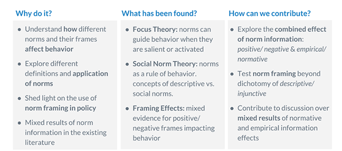

An existing gap in research surrounding the application of social norms reveals a neglect of the importance of frame effects, but also the potential downsides of implementing them in an incorrect way (i.e., individuals may infer the ‘bad side’ of a good norm). We seek to understand how to utilize framing to make norm interventions more effective. We refer to work by Robert Cialdini et al's (2006) comparison of descriptive versus injunctive norm messaging and Cristina Bicchieri's (2006, 2016) social norm theory that defines norms as a rule of behavior that people prefer to confirm to it on the condition that most in their reference network, either they "must"conform or they "should" conform. We conducted a 2x2 test of Empirical Expectation versus Normative Expectation in both Positive and Negative frame conditions to examine the variability of honesty between different norm treatments. Results inform us that negative framing resonates stronger to subjects and is more effective in deterring deviant behavior, and there are no significant differences between normative and empirical messages on cheating behavior.

### Motivation

### Opportunity

The aim of this research is to advance Cialdini et al’s work of testing descriptive vs
injunctive norms which does not distinguish between independent and interdependent behavior
by, leveraging Bicchieri’s (2006, 2016) framework, in which we will focus on the results of
interdependent behavior. Specifically, our study looks at normative and empirical expectation
presentation on dishonest behavior when delivered through either a positive or negative frame.
By doing so, we may begin to understand how different norms and their frames affect behavior,
so that we increase message consistency and reduce the knowledge gap.

