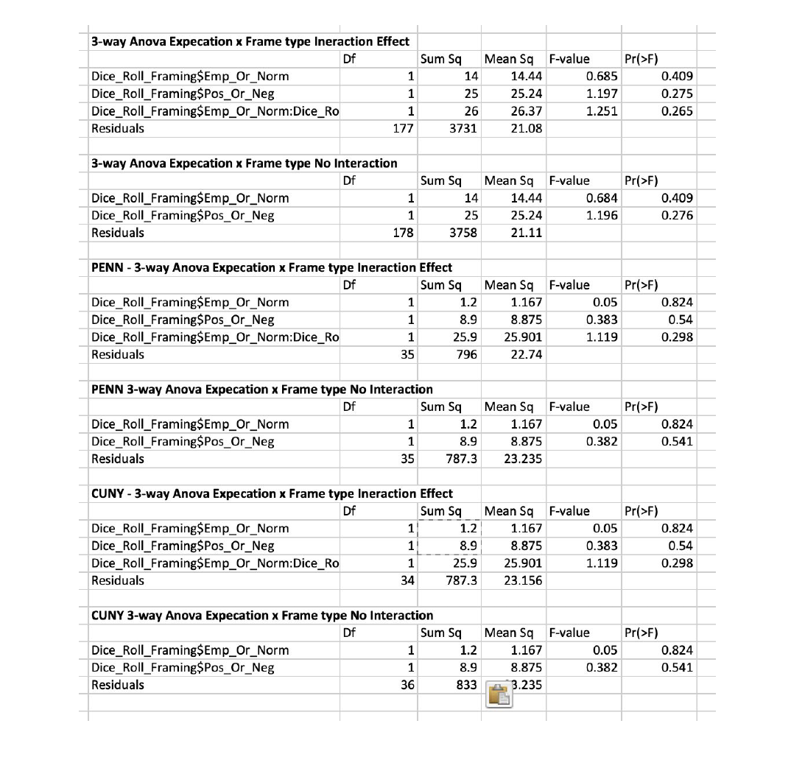

### Analysis Method
The primarly analysis method used was a 3-way ANOVA testing the Empirical Expectation versus Normative Expecation effect shrough either a Positive or Negative Frame. as well as the interaction effect of both Empirical/Normative + Positive/Negative.  While the study included a control group with N/34, our team realized, the control group may not have been necessary, and therefore the control treatment was not included in the ANOVA.

Underestimated at the start of this experiment was the necessity of a large sample size for our results to reveal any sort of significance. Both influential and related experiments   (Bicchieri, C., Dimant, E., Xiao, E 2017) (Mortensen, et al, 2018) reported samples sizes well over 400 participants.  Before we started to collect data, we agreed the initial analysis method used would be a 3-way ANOVA testing the Empirical Expectation versus Normative Expectation effect through either a Positive or Negative Frame as well as the interaction effect of both Empirical/Normative + Positive/Negative.

While the study included a control group with N/34, our team realized, the control group may not have been necessary, and therefore the control treatment was not included in the ANOVA.  As reporting in our analysis section, we recorded just 182 participants in total with the intention of capturing more. Thus, from an early point in our data collection, when we first reported at N=129, and then again at N= 182, we ran a 3-way ANOVA as initially planned to evaluate the power of our sample size.  In order to set up the ANOVA, we had to determine when the first instance of cheating occured. A person who lied on the first round of the game, score a 1, while the those reported truthfully scored an 11.

To eliminate any concern about location of participants, we ran additional ANOVAs with and without interaction effect for each school. Although all schools reported similar measurements, we are featuring CUNY and PENN because they had the highest rates of participants, and the reports were almost identical.  We knew at this point that geography was not an issue for our study.  The lack of power, however was an issue.   Yet, from a practicality standpoint, we were quickly able run a diagnostic on the data performance early and often informing us, in this case we needed to double, if not, triple our number of participants.


```{r setup, include=FALSE}
knitr::opts_chunk$set(echo = TRUE)
library(dplyr)
library(ggplot2)
library(readxl)
Dice_Roll_Framing <- read_excel("Dice Roll_Framing.xlsx")

report <- Dice_Roll_Framing[,20:29]
actual <- Dice_Roll_Framing[,40:49]
dif <- report - actual
firstLie <- c()
for (row in 1:dim(report)[1]) {
  lieNum <- which(dif[row,] %in% c(-10:-1,1:10))[1]
  if (is.na(c(lieNum))) {
    firstLie <- c(firstLie, 11)
  } else {
    firstLie <- c(firstLie, lieNum)
  }
}
Dice_Roll_Framing$LieNumber <- 11-firstLie

empOrNorm <- c()
posOrNeg <- c()
for (row in 1:dim(Dice_Roll_Framing)[1]) {
  if (!is.na(Dice_Roll_Framing[row,19])) {
    empOrNorm <- c(empOrNorm, 1)
    posOrNeg <- c(posOrNeg, 1)
  } else {
    if (!is.na(Dice_Roll_Framing[row,18])) {
      empOrNorm <- c(empOrNorm, 2)
      posOrNeg <- c(posOrNeg, 3)
    } else {
      if (!is.na(Dice_Roll_Framing[row,17])) {
        empOrNorm <-c(empOrNorm, 3)
        posOrNeg <- c(posOrNeg, 2)
      } else {
        if (!is.na(Dice_Roll_Framing[row,16])) {
          empOrNorm <- c(empOrNorm, 3)
          posOrNeg <- c(posOrNeg, 3)
        } else {
          empOrNorm <- c(empOrNorm, 2)
          posOrNeg <- c(posOrNeg, 2)
        }
      }
    }
  } 
}
Dice_Roll_Framing$Emp_Or_Norm <- empOrNorm
Dice_Roll_Framing$Pos_Or_Neg <- posOrNeg
# 3 way anova testing Empirical Message vs Normative Message effect vs Positive/Negative effect + Interaction effect of both Empirical/Normative + Pos/Neg
anovaWithInteraction <- aov(Dice_Roll_Framing$LieNumber ~ Dice_Roll_Framing$Emp_Or_Norm * Dice_Roll_Framing$Pos_Or_Neg)
summary(anovaWithInteraction)
# 3 way anova testing Empirical Message vs Normative Message effect vs Positive/Negative effect - no interaction effect

anovaWithoutInteraction <- update(anovaWithInteraction, . ~ . - (Dice_Roll_Framing$Emp_Or_Norm):(Dice_Roll_Framing$Pos_Or_Neg))
summary(anovaWithoutInteraction)
# I wanted to see if there was location effect, so ran this code per school, and found no inconsistencies.
cuny <- filter(Dice_Roll_Framing, Location=="CUNY")
cunyInteract <- aov(LieNumber ~ Emp_Or_Norm*Pos_Or_Neg, data=cuny)
cunyNoInteract <- update(cunyInteract, . ~ . - Emp_Or_Norm:Pos_Or_Neg)
summary(cunyInteract)
summary(cunyNoInteract)

penn <- filter(Dice_Roll_Framing, Location=="University of Pennsylvania")
pennInteract <- aov(LieNumber ~ Emp_Or_Norm*Pos_Or_Neg, data=cuny)
pennNoInteract <- update(pennInteract, . ~ . - Emp_Or_Norm:Pos_Or_Neg)
summary(pennInteract)
summary(pennNoInteract)

ucla <- filter(Dice_Roll_Framing, Location=="UCLA")
uclaInteract <- aov(LieNumber ~ Emp_Or_Norm*Pos_Or_Neg, data=cuny)
uclaNoInteract <- update(pennInteract, . ~ . - Emp_Or_Norm:Pos_Or_Neg)
summary(uclaInteract)
summary(uclaNoInteract)

temple <- filter(Dice_Roll_Framing, Location=="Temple")
templeInteract <- aov(LieNumber ~ Emp_Or_Norm*Pos_Or_Neg, data=cuny)
templeNoInteract <- update(pennInteract, . ~ . - Emp_Or_Norm:Pos_Or_Neg)
summary(templeInteract)
summary(templeNoInteract)

fit <- filter(Dice_Roll_Framing, Location=="FIT")
fitInteract <- aov(LieNumber ~ Emp_Or_Norm*Pos_Or_Neg, data=cuny)
fitNoInteract <- update(fitInteract, . ~ . - Emp_Or_Norm:Pos_Or_Neg)
summary(fitInteract)
summary(fitNoInteract)

bmcc <- filter(Dice_Roll_Framing, Location=="BMCC")
bmccInteract <- aov(LieNumber ~ Emp_Or_Norm*Pos_Or_Neg, data=cuny)
bmccNoInteract <- update(bmccInteract, . ~ . - Emp_Or_Norm:Pos_Or_Neg)
summary(bmccInteract)
summary(bmccNoInteract)

# Also wanted to see if there was any impact on the length of time someone spent playing the game...NOPE.

withDur <- aov(LieNumber ~ Emp_Or_Norm*Pos_Or_Neg*`Duration (in seconds)`, data=Dice_Roll_Framing)
summary(withDur)

#VARIABLES
ep <- filter(Dice_Roll_Framing, !is.na(EP))
en <- filter(Dice_Roll_Framing, !is.na(EN))
np <- filter(Dice_Roll_Framing, !is.na(NP))
nn <- filter(Dice_Roll_Framing, !is.na(NN))
c <- filter(Dice_Roll_Framing, !is.na(Control))
Risk <- filter(Dice_Roll_Framing, !is.na(Risk_1))
empiricalFemales <- filter(Dice_Roll_Framing, Gender=="Female", Emp_Norm==TRUE)
normFemales <- filter(Dice_Roll_Framing, Gender=="Female", Emp_Norm==FALSE)
empiricalMales <- filter(Dice_Roll_Framing, Gender=="Male", Emp_Norm==TRUE)
normMales <- filter(Dice_Roll_Framing, Gender=="Male", Emp_Norm==FALSE)
ControlFemales <- filter(Dice_Roll_Framing, Gender=="Female", Control!=TRUE)
ControlMales <- filter(Dice_Roll_Framing, Gender=="Male",  Control!=TRUE)
females <- filter(Dice_Roll_Framing, Gender == "Female")
males <- filter(Dice_Roll_Framing, Gender == "Male")

# I wanted to find percentages of honesty - breaking out people into groups of liars vs non-liars.  I did this by treatment,by gender, and location.
funct <- function(num) {return(num==0)}
epDif <- ep[,20:29]-ep[,40:49]
epBools <- funct(epDif)
lieScore <- c()
for (row in 1:dim(epBools)[1]) {
  val <- all(epBools[row,])
  lieScore <- c(lieScore, val)
}
ep$Honest <- lieScore
numEpHonest <- sum(ep$Honest)
propEpHonest <- numEpHonest/(dim(ep)[1])

enDif <- en[,20:29]-en[,40:49]
enBools <- funct(enDif)
honest <- c()
for (row in 1:dim(enBools)[1]) {
  val <- all(enBools[row,])
  honest <- c(honest, val)
}
en$Honest <- honest
numEnHonest <- sum(en$Honest)
propEnHonest <- numEnHonest/(dim(en)[1])

npDif <- np[,20:29]-np[,40:49]
npBools <- funct(npDif)
honest <- c()
for (row in 1:dim(npBools)[1]) {
  val <- all(npBools[row,])
  honest <- c(honest, val)
}
np$Honest <- honest
numNpHonest <- sum(np$Honest, na.rm=TRUE)
propNpHonest <- numNpHonest/(dim(np)[1])

nnDif <- nn[,20:29]-nn[,40:49]
nnBools <- funct(nnDif)
honest <- c()
for (row in 1:dim(nnBools)[1]) {
  val <- all(nnBools[row,])
  honest <- c(honest, val)
}
nn$Honest <- honest
numNnHonest <- sum(nn$Honest)
propNnHonest <- numNnHonest/(dim(nn)[1])

cDif <- c[,20:29]-c[,40:49]
cBools <- funct(cDif)
honest <- c()
for (row in 1:dim(cBools)[1]) {
  val <- all(cBools[row,])
  honest <- c(honest, val)
}
c$Honest <- honest
numCHonest <- sum(c$Honest)
propCHonest <- numCHonest/(dim(c)[1])
# Gina to repeat process for all conditions based on ep$Honest

# CUNY honesty rate
cunyDif <- cuny[,20:29]-cuny[,40:49]
cunyBools <- funct(cunyDif)
honest <- c()
for (row in 1:dim(cunyBools)[1]) {
  val <- all(cunyBools[row,])
  honest <- c(honest, val)
}
cuny$Honest <- honest
numCunyHonest <- sum(cuny$Honest)
propCunyHonest <- numCunyHonest/(dim(cuny)[1])

# PENN honesty rate
pennDif <- penn[,20:29]-penn[,40:49]
pennBools <- funct(pennDif)
honest <- c()
for (row in 1:dim(pennBools)[1]) {
  val <- all(pennBools[row,])
  honest <- c(honest, val)
}
penn$Honest <- honest
numPennHonest <- sum(penn$Honest)
propPennHonest <- numPennHonest/(dim(penn)[1])

# Empirical Female honesty rate
empiricalFemalesDif <- empiricalFemales[,20:29]-empiricalFemales[,40:49]
empiricalFemalesBools <- funct(empiricalFemalesDif)
honest <- c()
for (row in 1:dim(empiricalFemalesBools)[1]) {
  val <- all(empiricalFemalesBools[row,])
  honest <- c(honest, val)
}
empiricalFemales$Honest <- honest
numempiricalFemaleHonest <- sum(empiricalFemales$Honest)
propempiricalFemaleHonest <- numempiricalFemaleHonest/(dim(empiricalFemales)[1])

# Norm Female honesty rate
normFemalesDif <- normFemales[,20:29]-normFemales[,40:49]
normFemalesBools <- funct(normFemalesDif)
honest <- c()
for (row in 1:dim(normFemalesBools)[1]) {
  val <- all(normFemalesBools[row,])
  honest <- c(honest, val)
}
normFemales$Honest <- honest
numnormFemaleHonest <- sum(normFemales$Honest)
propnormFemaleHonest <- numnormFemaleHonest/(dim(normFemales)[1])

# Female Control honesty rate
ControlFemalesDif <- ControlFemales[,20:29]-ControlFemales[,40:49]
ControlFemalesBools <- funct(ControlFemalesDif)
honest <- c()
for (row in 1:dim(ControlFemalesBools)[1]) {
  val <- all(ControlFemalesBools[row,])
  honest <- c(honest, val)
}
ControlFemales$Honest <- honest
numControlFemalesHonest <- sum(ControlFemales$Honest)
propControlFemalesHonest <- numControlFemalesHonest/(dim(ControlFemales)[1])

# Female honesty rate
femalesDif <- females[,20:29]-females[,40:49]
femalesBools <- funct(femalesDif)
honest <- c()
for (row in 1:dim(femalesBools)[1]) {
  val <- all(femalesBools[row,])
  honest <- c(honest, val)
}
females$Honest <- honest
numFemaleHonest <- sum(females$Honest)
propFemaleHonest <- numFemaleHonest/(dim(females)[1])


# Male honesty rate
malesDif <- males[,20:29]-males[,40:49]
malesBools <- funct(malesDif)
honest <- c()
for (row in 1:dim(malesBools)[1]) {
  val <- all(malesBools[row,])
  honest <- c(honest, val)
}

males$Honest <- honest
numMaleHonest <- sum(males$Honest)
propMaleHonest <- numMaleHonest/(dim(males)[1])

# Empirical Male honesty rate
empiricalMalesDif <- empiricalMales[,20:29]-empiricalMales[,40:49]
empiricalMalesBools <- funct(empiricalMalesDif)
honest <- c()
for (row in 1:dim(empiricalMalesBools)[1]) {
  val <- all(empiricalMalesBools[row,])
  honest <- c(honest, val)
}
empiricalMales$Honest <- honest
numempiricalMaleHonest <- sum(empiricalMales$Honest)
propempiricalMaleHonest <- numempiricalMaleHonest/(dim(empiricalMales)[1])

# Norm Male honesty rate
normMalesDif <- normMales[,20:29]-normMales[,40:49]
normMalesBools <- funct(normMalesDif)
honest <- c()
for (row in 1:dim(normMalesBools)[1]) {
  val <- all(normMalesBools[row,])
  honest <- c(honest, val)
}
normMales$Honest <- honest
numNormMaleHonest <- sum(normMales$Honest)
propNormMaleHonest <- numNormMaleHonest/(dim(normMales)[1])

# Male Control honesty rate
ControlMalesDif <- ControlMales[,20:29]-ControlMales[,40:49]
ControlMalesBools <- funct(ControlMalesDif)
honest <- c()
for (row in 1:dim(ControlMalesBools)[1]) {
  val <- all(ControlMalesBools[row,])
  honest <- c(honest, val)
}
ControlMales$Honest <- honest
numControlMalesHonest <- sum(ControlMales$Honest)
propControlMalesHonest <- numControlMalesHonest/(dim(ControlMales)[1])

# There were 3 instances where people purposefully cheated, and wanted to remove these from results to check impact.
# Persons number 3, 4, and 66 seem not to take the survey honestly, since they would get a 
# result of 5 but not correctly report a value of 5, so they seem to just be writing 
# random entries.  We delete these from the data.

Dice_Roll_Framing <- Dice_Roll_Framing[-c(3,4,66),]
summary(aov(LieNumber ~ Emp_Or_Norm*Pos_Or_Neg, data=Dice_Roll_Framing))

dfTreatments <- data.frame(Type = c("Empirical Positive", "Empirical Negative", "Norm Positive", "Norm Negative", "Control"), `Proportion Honest` = c(propEpHonest, propEnHonest, propNpHonest, propNnHonest, propCHonest))
g <- ggplot(dfTreatments, aes(fill= Type, x=Type, y=Proportion.Honest))
g+geom_bar(position="dodge", stat="identity")

dfGenders <- data.frame(Gender=c("Male","Female"), `Proportion Honest`=c(propMaleHonest, propFemaleHonest))
ggplot(dfGenders, aes(fill=Gender, x=Gender, y=Proportion.Honest))+geom_bar(position="dodge", stat="identity")

dfFemaleProp <- data.frame(Framing=c("empiricalFemales","normfemales","ControlFemales" ), `Proportion Honest`=c(propempiricalFemaleHonest, propnormFemaleHonest, propControlFemalesHonest))
ggplot(dfFemaleProp, aes(fill=Framing, x=Framing, y=Proportion.Honest))+geom_bar(position="dodge", stat="identity")

dfMaleProp <- data.frame(Framing=c("empiricalMales","normMales","ControlMales" ), `Proportion Honest`=c(propempiricalMaleHonest,propNormMaleHonest, propControlMalesHonest))
ggplot(dfMaleProp, aes(fill=Framing, x=Framing, y=Proportion.Honest))+geom_bar(position="dodge", stat="identity")

# Histograms of risk, total, female, male

hist(Dice_Roll_Framing$Risk_1)

femaleRisk <- females$Risk_1
hist(femaleRisk)
maleRisk <- males$Risk_1
hist(maleRisk)

# A comparison of percentages

femaleRisk <- as.data.frame(table(femaleRisk))
femaleRiskPercent <- femaleRisk$Freq / sum(femaleRisk$Freq)
maleRisk <- as.data.frame(table(maleRisk))
maleRiskPercent <- maleRisk$Freq / sum(maleRisk$Freq)

#rough plot
barplot(femaleRiskPercent-maleRiskPercent)

#nicer looking plot
riskDF <- data.frame(score = c(0,1,2,3,4,5,6,7,8,9,10), `Female Minus Male Percents` = femaleRiskPercent-maleRiskPercent)
ggplot(riskDF, aes(fill = score, x = score, y=Female.Minus.Male.Percents))+geom_bar(stat="identity") +
  scale_x_continuous(breaks=seq(0,10))


# Get the mean of the empirical female's risk score
mean(empiricalFemales$Risk_1)
mean(normFemales$Risk_1, na.rm =TRUE)
```

## Results
<center>

</center>

As expected and compared to similar studies (Bicchieri, Dimant, Xiao 2017) Hilbig & Hessler 2013) who recorded significantly higher sample size, the results do not show any significance result between treatments, however, it was important to be able to evaluate the strength of each condition, so we looked at the impact, in this instance, of honesty rank against treatment group, and began to see the trend towards the efficacy of the normative negative condition.

##### Honesty rate by condition
```{r, echo=F}
dfTreatments <- data.frame(Type = c("Empirical Positive", "Empirical Negative", "Norm Positive", "Norm Negative", "Control"), `Proportion Honest` = c(propEpHonest, propEnHonest, propNpHonest, propNnHonest, propCHonest))
g <- ggplot(dfTreatments, aes(fill= Type, x=Type, y=Proportion.Honest))
g+geom_bar(position="dodge", stat="identity")

```

####While we could not reject the null nor find significance againt any of our hypotheses, two key insights began to emerge:

- People in the Normative Negative condition cheated the least, on average.

- Negatively-framed messages resulted in less cheating, on average, than positively-framed messages.

Additionally, we measured the honesty rate by gender for each treatment to see if there is a difference in behavior between men and women, and men did in fact rank 50/50 in both conditions. Note that the scales for the gender graphs are slightly different perspectives (female plot goes above .7 while the male plot only goes just to .6.). Our results are informed by small sample sizes, excluding control group, and incorporating both positive and negative frame conditions. The normative treatments overall have a higher efficacy on females participants, which is consistent with previous work (Fagley, et al, 2009) that could be a result of females having a greater ability for affective perspective taking (AFT).  AFT is ‘‘the ability to understand how a situation appears to another person and how that person is reacting cognitively and emotionally to the situation.”  Alternatively, only when men are asked to consider how they might feel, would they respond similarly to women under a frame effect. Historically, women perform higher in AFT measures. 

##### Female honesty rate by Empirical vs Normative Expectation
```{r, echo=F}
dfFemaleProp <- data.frame(Framing=c("empiricalFemales","normfemales"), `Proportion Honest`=c(propempiricalFemaleHonest, propnormFemaleHonest))
ggplot(dfFemaleProp, aes(fill=Framing, x=Framing, y=Proportion.Honest))+geom_bar(position="dodge", stat="identity")
```

##### Male honesty rate by Empirical vs Normative Expectation
```{r, echo=F}
dfMaleProp <- data.frame(Framing=c("empiricalMales","normMales"), `Proportion Honest`=c(propempiricalMaleHonest,propNormMaleHonest))
ggplot(dfMaleProp, aes(fill=Framing, x=Framing, y=Proportion.Honest))+geom_bar(position="dodge", stat="identity")

```


#### Self-reported risk evaluation by gender

In reviewing the variance between gender in the treatment group, we wanted to revisit the self-reported risk assessment results to see if there actually is a difference between gender and how risks are reviewed. The question as asked: “Please indicated on the scale if you are generally a person who is fully prepared to takes risks or who tries to avoid taking risks. 0 means not willing, 10 means very willing.”

This graph shows female rank on the top, (mean rank of 5.5 and median of 6.03), and males on the bottom (mean rank 6.5 and median of 7), and implies that males are more inclined to make high risk decisions. What is unique about the female reporting is that no females reported a 5, while a high number of males did, and the opposite happened for the 6 rank. The majority of males scored their risk between 7 and 9 revealing that men take higher risks than women. (Charness,Gneezy, 2012).

```{r, echo=F}
riskDF <- data.frame(score = c(0,1,2,3,4,5,6,7,8,9,10), `Female Minus Male Percents` = femaleRiskPercent-maleRiskPercent)
ggplot(riskDF, aes(fill = score, x = score, y=Female.Minus.Male.Percents))+geom_bar(stat="identity") +
  scale_x_continuous(breaks=seq(0,10))
```

### Next Steps

This is the first social norm to study the effects of norm expectations under positive/negative frames. Though we did not have enough power to get any significant results, my research team agreed to continue with further analysis to better understand how each individual condition was performing,  if there may be potential for signficance around the norm negative condition, and what we may be able to anticipate in further study.
